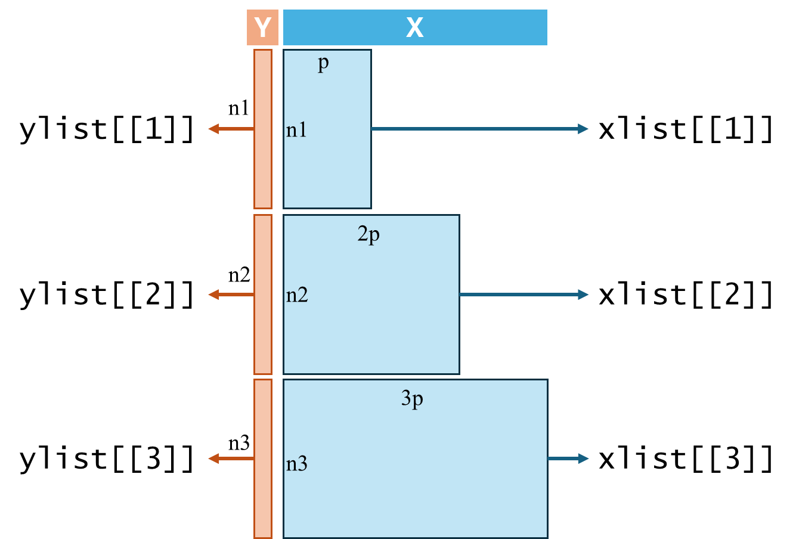

```{r setup, include=FALSE}
knitr::opts_chunk$set(echo = TRUE)
```

# Introduction

考慮 $p$ 個因子的多階段實驗資料，每個階段對此 $p$ 個因子有不同的設定值，使得解釋變數的維度隨著階段數線性增加。
資料包含至多 $Z$ 個階段實驗的實驗資料，定義 $X^{(z)}_{j}$ 為第 $z$ 個階段的第 $j$ 個因子，$j=1,\ldots,p$，$z=1,\ldots,Z$。

- 若實驗只進行一階段，則解釋變數為長度 $p$ 的向量：$\mathbf{x}^{(1)} = \left(x^{(1)}_{1}, x^{(1)}_{2}, \ldots, x^{(1)}_{p}\right)$
- 若實驗執行兩個階段，則解釋變數為長度 $2p$ 的向量： $\mathbf{x}^{(2)} = \left(x^{(1)}_{1}, x^{(1)}_{2}, \ldots, x^{(1)}_{p}, x^{(2)}_{1}, x^{(2)}_{2}, \ldots, x^{(2)}_{p}\right)$

以此類推。反應變數 $Y$ 為實數。此模組考慮多階段實驗資料的代理模型建構問題，如何針對資料中不同維度數目的解釋變數考量其之間的相關性，提出可行的 Gaussian Process 建模方式。


# Data Preparation


在此模組中，以 R `list` 物件分別儲存多階段實驗資料的解釋變數與反應變數，每個 list 儲存實驗階段相同的資料。
舉例來說，若資料包含至多**三個階段**的 $p$ 因子實驗數據，則解釋變數 `xlist` 與反應變數 `ylist` 分別為**長度為 3 **的 R `list` 物件。

- 解釋變數 `xlist` 中，第一格為單階段的 $p$ 因子實驗數據；`xlist` 的第二格為雙階段的 $p$ 因子實驗數據，共有 $2p$ 個因子；`xlist` 的第三格為三階段的 $p$ 因子實驗數據，共有 $3p$ 個因子
- 反應變數 `ylist`中，第一格為對應 `xlist[[1]]` 中單階段實驗的反應變數向量、第二格為對應 `xlist[[2]]` 中雙階段實驗的反應變數向量、第三格為對應 `xlist[[3]]` 中三階段實驗的反應變數向量。

```{r, echo=FALSE, fig.align='center', out.width='70%', fig.cap='多階段實驗資料儲存方式'}

```

以下使用內建測試函數生成資料作為範例。解釋變數由 **SFDesign** 套件生成 maximum projection (MaxPro) Latin hypercube design，再將解數變數輸入`testfunction.R`中的 Rastrigin 函數取得反應變數。為模擬多階段實驗的資料結構，此範例產生至多**三個階段**的 $p=2$ 因子實驗數據，每階段各 10 筆資料。

```{r loadex, echo=TRUE, eval=FALSE, message=FALSE, warning=FALSE}
source('R/testfunction.R')
library(SFDesign)
```

```{r traindata, echo=TRUE, eval=FALSE, message=FALSE, warning=FALSE}
### 設定各階段資料維度
p_data <- c(2, 4, 6)     # 各階段實驗的因子數
n_train <- c(10, 10, 10) # 訓練資料各階段實驗的樣本數

### 使用 maxproLHD 產生測試資料的解釋變數
xList <- lapply(1:length(p_data), function(k) {
  maxproLHD(n_train[k], p_data[k])$design
})

### 以 Rastrigin 函數產生訓練資料各階段模擬資料的反應變數 
yList <- lapply(1:length(p_data), function(k) {
  tmp <- numeric(nrow(xList[[k]]))
  for (i in 1:nrow(xList[[k]])) {
    tmp[i] <- Rastrigin(xList[[k]][i,])
  }
  tmp
})
```

為說明後續模型函數的使用方法，再產生一組每階段各 3 筆的測試資料。

```{r testdata, echo=TRUE, eval=FALSE, message=FALSE, warning=FALSE}
### 測試資料各階段實驗的樣本數
n_test <- c(3, 3, 3) 

### 使用 maxproLHD 產生測試資料的解釋變數
x0List <- lapply(1:length(p_data), function(k) {
  maxproLHD(n_test[k], p_data[k])$design
})

### 以 Rastrigin 函數產生測試資料各階段模擬資料的反應變數 
y0List <- lapply(1:length(p_data), function(k) {
  tmp <- numeric(nrow(x0List[[k]]))
  for (i in 1:nrow(x0List[[k]])) {
    tmp[i] <- Rastrigin(x0List[[k]][i,])
  }
  tmp
})
```

# Gaussian Process Modelling

給定 $n$ 筆資料為 $\{y_i, \mathbf{x}_i\}$，$i=1,\ldots,n$，其中 $y_i$ 為實值解釋變數，$\mathbf{x}_i$ 為解釋變數向量。
首先說明 GP 模型基礎框架：

$$Y = (y_1, \ldots, y_n) \sim MVN\left(\boldsymbol\mu, \sigma^2\Psi\right)$$
其中 $\boldsymbol\mu = \left(\mu(x_1), \ldots, \mu(x_n)\right)^\top$ 為反應變數之期望值，$\sigma^2\in \mathbb{R}$ 為變異數且 $\Psi\in \mathbb{R}^{n\times n}$ 描述 資料點之間的關聯性。一般而言，當解釋變數 $\mathbf{x}_i$ 為數值型且每筆資料解釋變數維度相等時，$\mathbf{x}_i=(x_1, x_2, \ldots, x_p)^\top$，
資料 $Y(s)$ 與 $Y(t)$ 之間的相關性常以高斯核函數（kernel function）表示：
$$
\Psi_{st} = \text{corr}\left(Y(s), Y(t)\right) =
\exp\left(-\sum_{j=1}^p \theta_j (x_{js} - x_{jt})^2\right)
$$
其中，$\theta_j$，$j=1,\ldots,p$ 為模型參數。

此模組提出數種針對多階段實驗資料的 Gaussian Process（GP）建構方式。考慮資料中多階段實驗的最多階段數為 $Z$，因不同階段數的實驗因子量不同，將上述 $n$ 筆資料加上輔助用的隱藏變數，階段數標記 $z$，改寫為 $\left\{y^{(z)}_i, \mathbf{x}^{(z)}_i\right\}$，$i=1,\ldots,n_z$，$z=1,\ldots,Z$ 且 $\sum_{z=1}^Z n_z = n$。在此，解釋變數為數值型，但當兩資料來自不同階段數的實驗時，解釋變數維度則不相同，如何在此情況下描述兩兩資料間的相關性即為本模組之關鍵，以下小節分別說明提出之相關性核函數構想與實作方式。


## Additive Correlation Structure with Interaction Kernel

本節考慮於連加相關結構中加入交互作用描述來自不同階段數的兩筆實驗資料 $Y(s)$ 與 $Y(t)$ 間的相關性
$$
\begin{align*}
\Psi_{st} & =  \sum_{z=1}^{\min{\{z_s, z_t\}}} \sigma_z^2
\exp{\left\{
    -  \sum_{j=1}^p {
        \theta^{(z)}_j \left(x^{(z)}_{js} - x^{(z)}_{jt}\right)^2 
    }
\right\}} \\
& + \sum_{v=1}^{\min{\{z_s, z_t\}}}\sum_{u=1, u\neq v}^{v} \sigma_{u, v}^2 
\exp{\left\{
    -  \sum_{j=1}^p {
        \theta^{(v)}_j \left(x^{(v)}_{js} - x^{(v)}_{jt}\right)^2 
    }
\right\}}
\exp{\left\{
    -  \sum_{j=1}^p {
        \theta^{(u)}_j \left(x^{(u)}_{js} - x^{(u)}_{jt}\right)^2 
    }
\right\}}
\end{align*}
$$
在此模型考量下，模型參數包含期望值 $\mu$、各項相關結構之變異數 $\sigma_z^2$，$z=1,\ldots,Z$，與 $\sigma_{z_u,z_v}^2=\sigma_{z_v,z_u}^2$，$u,v=1,\ldots,Z, u\neq v$，以及各解釋變數的距離參數 $\theta^{(z)}_j$ ， $j=1,\ldots,p$ ， $z=1,\ldots,Z$。

模組使用方式如下，首先引入模組程式 `R/aladderGP.R`。

```{r loada, echo=TRUE, eval=FALSE, message=FALSE, warning=FALSE}
source('R/aladderGP.R')
```

`aladderGP.R` 模組程式有兩個功能函數：`aLadderFit` 及 `aLadderPred`，前者用於 GP 模型建立，後者基於模型與輸入的新資料進行預測。以下分別說明兩函數的用法。

### `aLadderFit` 

建立包含交互作用以描述兩不同階段數實驗資料的連加相關結構 GP 模型，`aLadderFit` 函數輸入值說明及使用範例如下：

| 輸入變數名稱       | 說明                                                                                                   | 預設值         |
| ------------------ | ------------------------------------------------------------------------------------------------------ | -------------- |
| `yList`            | R list 物件。每個 list 內存放對應階數的單維反應變數 (見第一節範例)                                     |                |
| `xList`            | R list 物件。每個 list 內存放對應階數的多維解釋變數 (見第一節範例)                                     |                |
| `contiParLogRange` | 長度為 2 的 R 向量。$\theta^{(z)}$ 的 **log 尺度** 搜尋範圍(最小值、最大值)。                          | `c(-6.5, 1.5)` |
| `varParLogRange`   | 長度為 2 的 R 向量。各 $\sigma$ 的 **log 尺度** 搜尋範圍(最小值、最大值)。                             | `c(-6.5, 1.5)` |
| `nSwarm`           | 正整數。PSO 粒子數，用於 likelihood 最佳化。                                                           | `64`           |
| `maxIter`          | 正整數。PSO 迭代次數，用於 likelihood 最佳化。                                                         | `200`          |
| `psoType`          | 文字。PSO 機制選擇，有兩項可選：`"basic"` 或 `"quantum`                                                | `"basic"`      |
| `nugget`           | 正數。GP 相關矩陣的正定性調整值，通常為很小的數，如 `1e-6`。若輸入 `0` 則由函數自動判斷是否加上調整值。| `1e-6`         |
| `optVerbose`       | 是否顯示 likelihood 最佳化進度。                                                                       | `TRUE`         |


```{r aladderm, echo=TRUE, eval=FALSE, message=FALSE, warning=FALSE}
aLadderMdl <- aLadderFit(yList, xList, 
                         contiParLogRange = c(-6.5, 1.5), varParLogRange = c(-6.5, 1.5), 
                         nSwarm = 64, maxIter = 200, psoType = "basic", nugget = 1e-6, optVerbose = FALSE)
```


`aLadderFit` 函數輸出一個 R List 物件，包含各項模型參數估計值與原始訓練資料，輸出值說明如下： 

| 輸出變數名稱 | 說明                                                                                                   |
| ------------ | ------------------------------------------------------------------------------------------------------ |
| `mu`         | 實數。GP 模型的期望值 $\mu$。                                                                          |
| `thetaZ`     | 大小 $Z\times p$ 的實數矩陣。第 $z$ Row、第 $j$ column 的值為 $\theta^{(z)}_j$。                       |
| `sigmaF`     | 長度為 $Z$ 的實數向量。$\sigma_z^2$                                      |
| `sigmaInt`   | 大小 $Z\times Z$ 的實數矩陣。$\sigma_{z_1,z_2}^2$                           |
| `psi`        | 大小 $n\times n$ 的實數矩陣。GP 模型的共變異數矩陣。                                                   |
| `invPsi`     | 大小 $n\times n$ 的實數矩陣。GP 模型共變異數矩陣的反矩陣（方便後續應用模型時取用）。                   |
| `negloglik`  | 實數。此 GP 模型的負對數概似值。                                                                       |
| `nugget`     | 實數。GP 相關矩陣所使用的正定性調整值。                                                                |
| `vecParams`  | 實數向量。模組排列的 GP 模型參數向量（方便後續應用模型時取用）                                         |
| `data`       | 模組排列的訓練資料集。                                                                                 |
| `cputime`    | 配適此 GP 模型的計算時間。                                                                             |


### `aLadderPred` 

輸入新資料，以包含交互作用以描述兩不同階段數實驗資料的連加相關結構 GP 模型進行預測，`aLadderPred` 函數輸入值說明及使用範例如下：

| 輸入變數名稱    | 說明                                                                                                   | 預設值         |
| --------------- | ------------------------------------------------------------------------------------------------------ | -------------- |
| `gpMdl`         | R list 物件。經 `mLadderFit` 函數訓練後的 GP 模型物件                                                  | 無             |
| `x0List`        | R list 物件。測試資料，每個 list 內存放對應階數的多維解釋變數 (見第一節範例)                           | 無             |
| `y0listTrue`    | R list 物件。可不輸入，測試資料，每個 list 內存放對應階數的反應變數 (見第一節範例)                     | `NULL`         |


`aLadderPred` 函數輸出一個 R List 物件，包含模型預測值與 MSE，輸出值說明如下： 


| 輸出變數名稱    | 說明                                  |
| --------------- | ------------------------------------- |
| `pred`          | 向量。GP 模型的預測值。               |
| `mse`           | 向量。預測值的 MSE。                  |
| `y_true`        | 向量。測試資料的真實反應變數值。      |


```{r aladderp, echo=TRUE, eval=FALSE, message=FALSE, warning=FALSE}
aLadderPred(aLadderMdl, x0List)$pred
```
```{r aladderpmse, echo=TRUE, eval=FALSE, message=FALSE, warning=FALSE}
aLadderPred(aLadderMdl, x0List)$mse 
```


## Multiplicative Stage-crossing Correlation Structure

本節考慮於連乘相關結構中，針對隱藏變數階段數標記 $z$，加入關聯參數描述來自不同階段數的兩筆實驗資料 $Y(s)$ 與 $Y(t)$ 間的相關性，又可分為

- 視隱藏變數階段數標記為 ordinal 變數時，考慮來自階段數差異的關聯性 $\tau$
$$
\Psi_{st} = \exp{\left\{
    -\tau (z_s - z_t)^2 
    - \sum_{z=1}^{\min{\{z_s, z_t\}}} \sum_{j=1}^d {
        \theta^{(z)}_j \left(x^{(z)}_{js} - x^{(z)}_{jt}\right)^2 
    }
\right\}}
$$
在此關聯結構考量下，模型參數包含期望值與變異數 $\mu$、$\sigma^2$，及各階段資料間的關聯參數 $\tau$，以及各解釋變數的距離參數 $\theta^{(z)}_j$ ， $j=1,\ldots,p$ ， $z=1,\ldots,Z$ 。

- 視隱藏變數階段數標記為 nominal 變數時，考慮來自兩個不同階段的關聯性 $\tau_{z_s, z_t} = \tau_{z_t, z_s}$ ， $z_s, z_t = 1,\ldots,Z$ ， $z_s \neq z_t$
$$
\Psi_{st} =  \tau_{z_s, z_t} \cdot
\exp{\left\{
    - \sum_{z=1}^{\min{\{z_s, z_t\}}} \sum_{j=1}^d {
        \theta^{(z)}_j \left(x^{(z)}_{js} - x^{(z)}_{jt}\right)^2 
    }
\right\}}
$$
在此關聯結構考量下，模型參數包含期望值與變異數 $\mu$、$\sigma^2$，及各階段資料間的關聯參數 $\tau_{z_s, z_t} = \tau_{z_t, z_s}$ ， $z_s, z_t = 1,\ldots,Z$ ， $z_s \neq z_t$ ，以及各解釋變數的距離參數 $\theta^{(z)}_j$ ， $j=1,\ldots,p$ ， $z=1,\ldots,Z$。


模組使用方式如下，首先引入模組程式 `R/mladderGP.R`。


```{r loadm, echo=TRUE, eval=FALSE, message=FALSE, warning=FALSE}
source('R/mladderGP.R')
```

`mladderGP.R` 模組程式有兩個功能函數：`mLadderFit` 及 `mLadderPred`，前者用於 GP 模型建立，後者基於模型與輸入的新資料進行預測。以下分別說明兩函數的用法。


### `mLadderFit` 

| 輸入變數名稱       | 說明                                                                                                   | 預設值         |
| ------------------ | ------------------------------------------------------------------------------------------------------ | -------------- |
| `yList`            | R list 物件。每個 list 內存放對應階數的單維反應變數 (見第一節範例)                                     |                |
| `xList`            | R list 物件。每個 list 內存放對應階數的多維解釋變數 (見第一節範例)                                     |                |
| `zType`            | Char 物件。指定不同階數間訊息的關聯方式，`"o"`：視階數為 ordinal 變數，`"n"`：視階數為 nominal 變數。  | `"o"`          |
| `contiParLogRange` | 長度為 2 的 R 向量。$\theta^{(z)}$ 的 **log 尺度** 搜尋範圍(最小值、最大值)。                          | `c(-6.5, 1.5)` |
| `categParLogRange` | 長度為 2 的 R 向量。各 $\tau_{z_s, z_t}$ 的 **log 尺度** 搜尋範圍(最小值、最大值)。                    | `c(-2.0, 0.5)` |
|                    | 僅適用於 `zType = "n"` 時。                                                                            |                |
| `nSwarm`           | 正整數。PSO 粒子數，用於 likelihood 最佳化。                                                           | `64`           |
| `maxIter`          | 正整數。PSO 迭代次數，用於 likelihood 最佳化。                                                         | `200`          |
| `psoType`          | 文字。PSO 機制選擇，有兩項可選：`"basic"` 或 `"quantum`                                                | `"basic"`      |
| `nugget`           | 正數。GP 相關矩陣的正定性調整值，通常為很小的數，如 `1e-6`。若輸入 `0` 則由函數自動判斷是否加上調整值。| `1e-6`         |
| `optVerbose`       | 是否顯示 likelihood 最佳化進度。                                                                       | `TRUE`         |


```{r mladderom, echo=TRUE, eval=FALSE, message=FALSE, warning=FALSE}
mLadderMdl_o <- mLadderFit(yList, xList, zType = "o", 
                           contiParLogRange = c(-6.5, 1.5), categParLogRange = c(-2.0, 0.5), 
                           nSwarm = 64, maxIter = 200, psoType = "basic", nugget = 1e-6, optVerbose = FALSE)
```

```{r mladdernm, echo=TRUE, eval=FALSE, message=FALSE, warning=FALSE}
mLadderMdl_n <- mLadderFit(yList, xList, zType = "n", 
                           contiParLogRange = c(-6.5, 1.5), categParLogRange = c(-2.0, 0.5), 
                           nSwarm = 64, maxIter = 200, psoType = "basic", nugget = 1e-6, optVerbose = FALSE)
```

| 輸出變數名稱 | 說明                                                                                                   |
| ------------ | ------------------------------------------------------------------------------------------------------ |
| `mu`         | 實數。GP 模型的期望值 $\mu$。                                                                          |
| `sigma2`     | 實數。GP 模型的變異數 $\sigma^2$。                                                                     |
| `tau`        | `zType = "o"` 時，為實數。視階數為 ordinal 變數時，對不同階數資料的關聯參數 $\tau$。                   |
|              | `zType = "n"` 時，為大小 $Z\times Z$ 的實數矩陣。視階數為 nominal 變數時，對不同階數資料的關聯參數，   |
|              |   各 element 分別為 $\tau_{z_s, z_t}$，$z_s, z_t = 1,\ldots,Z$。                                       |
| `theta`      | 大小 $Z\times p$ 的實數矩陣。第 $z$ Row、第 $j$ column 的值為 $\theta^{(z)}_j$。                       |
| `psi`        | 大小 $n\times n$ 的實數矩陣。GP 模型的共變異數矩陣。                                                   |
| `invPsi`     | 大小 $n\times n$ 的實數矩陣。GP 模型共變異數矩陣的反矩陣（方便後續應用模型時取用）。                   |
| `negloglik`  | 實數。此 GP 模型的負對數概似值。                                                                       |
| `nugget`     | 實數。GP 相關矩陣所使用的正定性調整值。                                                                |
| `vecParams`  | 實數向量。模組排列的 GP 模型參數向量（方便後續應用模型時取用）                                         |
| `zType`      | Char。GP 模型對不同階數間訊息的關聯方式，`"o"`：視階數為 ordinal 變數，`"n"`：視階數為 nominal 變數。  |
| `data`       | 模組排列的訓練資料集。                                                                                 |
| `cputime`    | 配適此 GP 模型的計算時間。                                                                             |


### `mLadderPred` 

輸入新資料，以加入關聯參數以描述兩不同階段數實驗資料的連乘相關結構 GP 模型進行預測，`mLadderPred` 函數輸入值說明及使用範例如下：

| 輸入變數名稱    | 說明                                                                                                   | 預設值         |
| --------------- | ------------------------------------------------------------------------------------------------------ | -------------- |
| `gpMdl`         | R list 物件。經 `mLadderFit` 函數訓練後的 GP 模型物件                                                  | 無             |
| `x0List`        | R list 物件。測試資料，每個 list 內存放對應階數的多維解釋變數 (見第一節範例)                           | 無             |
| `y0listTrue`    | R list 物件。可不輸入，測試資料，每個 list 內存放對應階數的反應變數 (見第一節範例)                     | `NULL`         |

`mLadderPred` 函數輸出一個 R List 物件，包含模型預測值與 MSE，輸出值說明如下： 

| 輸出變數名稱    | 說明                                  |
| --------------- | ------------------------------------- |
| `pred`          | 向量。GP 模型的預測值。               |
| `mse`           | 向量。預測值的 MSE。                  |
| `y_true`        | 向量。測試資料的真實反應變數值。      |

```{r mladderop, echo=TRUE, eval=FALSE, message=FALSE, warning=FALSE}
mLadderPred(mLadderMdl_o, x0List)$pred
```
```{r mladderopmse, echo=TRUE, eval=FALSE, message=FALSE, warning=FALSE}
mLadderPred(mLadderMdl_o, x0List)$mse 
```

```{r mladdernp, echo=TRUE, eval=FALSE, message=FALSE, warning=FALSE}
mLadderPred(mLadderMdl_n, x0List)$pred
```

```{r mladdernpmse, echo=TRUE, eval=FALSE, message=FALSE, warning=FALSE}
mLadderPred(mLadderMdl_n, x0List)$mse
```

## Neglected Stage-crossing Correlation Structure (for comparison)

為探討前述兩種（連加型與連乘型 GP 模型）於 Ladder-shaped 資料的建模表現，本節提供一較為單純的 GP 模型關聯架構，不針對兩階段數相異的資料考慮其間的關聯參數，僅考慮兩資料於共通階段時因子間的關聯性
$$
\Psi_{st} = \exp{\left\{
    - \sum_{z=1}^{\min{\{z_s, z_t\}}} \sum_{j=1}^d {
        \theta^{(z)}_j \left(x^{(z)}_{js} - x^{(z)}_{jt}\right)^2 
    }
\right\}}
$$
在此關聯結構考量下，模型參數包含期望值與變異數 $\mu$、$\sigma^2$，以及各解釋變數的距離參數 $\theta^{(z)}_j$ ， $j=1,\ldots,p$ ， $z=1,\ldots,Z$ 。

模組使用方式如下，首先引入模組程式 `R/nvladderGP.R`。


```{r loadnv, echo=TRUE, eval=FALSE, message=FALSE, warning=FALSE}
source('R/nvladderGP.R')
```

`nvladderGP.R` 模組程式有兩個功能函數：`nvLadderFit` 及 `nvLadderPred`，前者用於 GP 模型建立，後者基於模型與輸入的新資料進行預測。以下分別說明兩函數的用法。


### `nvLadderFit` 

| 輸入變數名稱       | 說明                                                                                                   | 預設值         |
| ------------------ | ------------------------------------------------------------------------------------------------------ | -------------- |
| `yList`            | R list 物件。每個 list 內存放對應階數的單維反應變數 (見第一節範例)                                     |                |
| `xList`            | R list 物件。每個 list 內存放對應階數的多維解釋變數 (見第一節範例)                                     |                |
| `contiParLogRange` | 長度為 2 的 R 向量。$\theta^{(z)}$ 的 **log 尺度** 搜尋範圍(最小值、最大值)。                          | `c(-6.5, 1.5)` |
| `nSwarm`           | 正整數。PSO 粒子數，用於 likelihood 最佳化。                                                           | `64`           |
| `maxIter`          | 正整數。PSO 迭代次數，用於 likelihood 最佳化。                                                         | `200`          |
| `psoType`          | 文字。PSO 機制選擇，有兩項可選：`"basic"` 或 `"quantum`                                                | `"basic"`      |
| `nugget`           | 正數。GP 相關矩陣的正定性調整值，通常為很小的數，如 `1e-6`。若輸入 `0` 則由函數自動判斷是否加上調整值。| `1e-6`         |
| `optVerbose`       | 是否顯示 likelihood 最佳化進度。                                                                       | `TRUE`         |


```{r nvladderm, echo=TRUE, eval=FALSE, message=FALSE, warning=FALSE}
nvLadderMdl <- nvLadderFit(yList, xList, contiParLogRange = c(-6.5, 1.5), 
                           nSwarm = 64, maxIter = 200, psoType = "basic", nugget = 1e-6, optVerbose = FALSE)
```

| 輸出變數名稱 | 說明                                                                                                   |
| ------------ | ------------------------------------------------------------------------------------------------------ |
| `mu`         | 實數。GP 模型的期望值 $\mu$。                                                                          |
| `sigma2`     | 實數。GP 模型的變異數 $\sigma^2$。                                                                     |
| `theta`      | 大小 $Z\times p$ 的實數矩陣。第 $z$ Row、第 $j$ column 的值為 $\theta^{(z)}_j$。                       |
| `psi`        | 大小 $n\times n$ 的實數矩陣。GP 模型的共變異數矩陣。                                                   |
| `invPsi`     | 大小 $n\times n$ 的實數矩陣。GP 模型共變異數矩陣的反矩陣（方便後續應用模型時取用）。                   |
| `negloglik`  | 實數。此 GP 模型的負對數概似值。                                                                       |
| `nugget`     | 實數。GP 相關矩陣所使用的正定性調整值。                                                                |
| `vecParams`  | 實數向量。模組排列的 GP 模型參數向量（方便後續應用模型時取用）                                         |
| `data`       | 模組排列的訓練資料集。                                                                                 |
| `cputime`    | 配適此 GP 模型的計算時間。                                                                             |


### `nvLadderPred` 

輸入新資料，以不包含描述兩階段數相異實驗資料間的關聯參數之 GP 模型進行預測，`nvLadderPred` 函數輸入值說明及使用範例如下：

| 輸入變數名稱    | 說明                                                                                                   | 預設值         |
| --------------- | ------------------------------------------------------------------------------------------------------ | -------------- |
| `gpMdl`         | R list 物件。經 `nvLadderFit` 函數訓練後的 GP 模型物件                                                  | 無             |
| `x0List`        | R list 物件。測試資料，每個 list 內存放對應階數的多維解釋變數 (見第一節範例)                           | 無             |
| `y0listTrue`    | R list 物件。可不輸入，測試資料，每個 list 內存放對應階數的反應變數 (見第一節範例)                     | `NULL`         |

`nvLadderPred` 函數輸出一個 R List 物件，包含模型預測值與 MSE，輸出值說明如下： 

| 輸出變數名稱    | 說明                                  |
| --------------- | ------------------------------------- |
| `pred`          | 向量。GP 模型的預測值。               |
| `mse`           | 向量。預測值的 MSE。                  |
| `y_true`        | 向量。測試資料的真實反應變數值。      |

```{r nvladderop, echo=TRUE, eval=FALSE, message=FALSE, warning=FALSE}
nvLadderPred(nvLadderMdl, x0List)$pred
```
```{r nvladderopmse, echo=TRUE, eval=FALSE, message=FALSE, warning=FALSE}
nvLadderPred(nvLadderMdl, x0List)$mse 
```

# Full Demostration

以下為完整示範例，利用模擬的訓練資料建立 GP 模型，再使用測試資料進行預測並與真實質比較，計算 RMSE。

```{r fulldemo, echo=TRUE, eval=TRUE, message=FALSE, warning=FALSE}
### 引入 Demo 須要用的 Space Filling Design 套件
library(SFDesign)
### 引入測試用函數集
source('R/testfunction.R')
### 引入 GP 模組
source('R/nvladderGP.R')
source('R/aladderGP.R')
source('R/mladderGP.R')

### 設定各階段資料維度
p_data <- c(2, 4, 6)     # 各階段實驗的因子數
n_train <- c(10, 10, 10) # 訓練資料各階段實驗的樣本數

### 使用 maxproLHD 產生測試資料的解釋變數
xList <- lapply(1:length(p_data), function(k) {
  maxproLHD(n_train[k], p_data[k])$design
})

### 以 Rastrigin 函數產生訓練資料各階段模擬資料的反應變數 
yList <- lapply(1:length(p_data), function(k) {
  tmp <- numeric(nrow(xList[[k]]))
  for (i in 1:nrow(xList[[k]])) {
    tmp[i] <- Rastrigin(xList[[k]][i,])
  }
  tmp
})

### 測試資料各階段實驗的樣本數
n_test <- c(3, 3, 3) 

### 使用 maxproLHD 產生測試資料的解釋變數
x0List <- lapply(1:length(p_data), function(k) {
  maxproLHD(n_test[k], p_data[k])$design
})

### 以 Rastrigin 函數產生測試資料各階段模擬資料的反應變數 
y0List <- lapply(1:length(p_data), function(k) {
  tmp <- numeric(nrow(x0List[[k]]))
  for (i in 1:nrow(x0List[[k]])) {
    tmp[i] <- Rastrigin(x0List[[k]][i,])
  }
  tmp
})


# ### 建立不包含描述兩階段數相異實驗資料間的關聯參數之 GP 模型 
# #(不穩定)
# nvLadderMdl <- nvLadderFit(yList, xList, contiParLogRange = c(-6.5, 1.5),
#                            nSwarm = 64, maxIter = 200, psoType = "basic", nugget = 1e-6, optVerbose = FALSE)
# 
# 
# ### 以 nvLadderMdl GP 模型對測試資料進行預測並檢視 RMSE
# nvPred <- nvLadderPred(nvLadderMdl, x0List, y0listTrue = y0List)
# cat(sprintf("RMSE(nvLadderMdl) = %.4f\n", sqrt(sum((nvPred$pred - nvPred$y_true)^2))))


### 建立包含交互作用以描述兩不同階段數實驗資料的連加相關結構 GP 模型
aLadderMdl <- aLadderFit(yList, xList, 
                         contiParLogRange = c(-6.5, 1.5), varParLogRange = c(-6.5, 1.5), 
                         nSwarm = 64, maxIter = 200, psoType = "basic", nugget = 1e-6, optVerbose = FALSE)

### 以 aLadderMdl GP 模型對測試資料進行預測並檢視 RMSE
aPred <- aLadderPred(aLadderMdl, x0List, y0listTrue = y0List)
cat(sprintf("RMSE(aLadderMdl) = %.4f\n", sqrt(sum((aPred$pred - aPred$y_true)^2))))


### 建立包含 Ordinal Type 關聯參數以描述兩不同階段數實驗資料的連乘相關結構 GP 模型
mLadderMdl_o <- mLadderFit(yList, xList, zType = "o", 
                           contiParLogRange = c(-6.5, 1.5), categParLogRange = c(-2.0, 0.5), 
                           nSwarm = 64, maxIter = 200, psoType = "basic", nugget = 1e-6, optVerbose = FALSE)

### 以 mLadderMdl_o GP 模型對測試資料進行預測並檢視 RMSE
mPred_o <- mLadderPred(mLadderMdl_o, x0List, y0listTrue = y0List)
cat(sprintf("RMSE(mLadderMdl_o) = %.4f\n", sqrt(sum((mPred_o$pred - mPred_o$y_true)^2))))


### 建立包含 Nominal Type 關聯參數以描述兩不同階段數實驗資料的連乘相關結構 GP 模型
mLadderMdl_n <- mLadderFit(yList, xList, zType = "n", 
                           contiParLogRange = c(-6.5, 1.5), categParLogRange = c(-2.0, 0.5), 
                           nSwarm = 64, maxIter = 200, psoType = "basic", nugget = 1e-6, optVerbose = FALSE)

### 以 mLadderMdl_n GP 模型對測試資料進行預測並檢視 RMSE
mPred_n <- mLadderPred(mLadderMdl_n, x0List, y0listTrue = y0List)
cat(sprintf("RMSE(mLadderMdl_n) = %.4f\n", sqrt(sum((mPred_n$pred - mPred_n$y_true)^2))))
```


